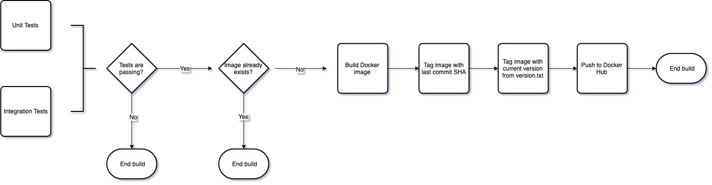

# Will.IAM

Will.IAM solves identity and access management.

* Authentication with Google as OAUTH-2 provider.
  * Refresh token
* RBAC authorization
  Permissions+Roles+/am
* SSO - Single Sign-On
  * SSO browser handler should save/get to/from localStorage and redirect to requester

  Client redirects to server (browser), server has token in localStorage, redirects back with stored token. No button clicks :) Client should be careful to not log token to other parties (e.g google analytics)

## About RBAC use cases and implementation

Client projects of Will.IAM define permissions necessary for resource operation.

Using Maestro, https://github.com/topfreegames/maestro, as an example:

In order to get a list of schedulers, users must have ListSchedulers permission.

Permissions are written in a specific format **{Service}::{OwnershipLevel}::{Action}::{Resource::Hierarchy}**. So, ListSchedulers could be had in a diversity of ways:

Maestro::RO::ListSchedulers::*

Maestro::RL::ListSchedulers::NA::Sniper3D::*

Maestro::RL::ListSchedulers::NA::Sniper3D::sniper3d-game

You'll know more about Will.IAM permissions later. If someone has **Maestro::RL::ListSchedulers::NA::Sniper3D::\***, then Maestro will only respond schedulers under NA::Sniper3D's domain.

## Permissions

Every permission has four components:

### Service

A naming reference to any application service account that uses Will.IAM as IAM solution.

### Ownership Level

**ResourceOwner**: Can exercise the action over the resource and provide the exact
same rights to other parties.

**ResourceLender**: Can only exercise the action over the resource.

### Action

A verb defined by Will.IAM clients.

### Resource Hierarchy

Can be complete or open, in the sense that an open hierarchy will probably lead to access to multiple items under a domain.

## Client side - /am route

Will.IAM clients should expose a **GET /am** route that will help list actions and resource hierarchies to which the requester has some level os access.

E.g:

**GET /am** -> will respond all verbs (actions) the requester has access

**GET /am?prefix=ListSchedulers** -> all regions that requester can ListSchedulers

**GET /am?prefix=ListSchedulers::NA** -> all games that requester can ListSchedulers in NA

**GET /am?prefix=ListSchedulers::NA::Sniper3D** -> all schedulers in NA::Sniper3D

To a requester with full access over the client, this means it will list all possible permissions and resources possible to be granted OwnershipLevel::Action to another party.

### Complete permissions

When calling GET /am?prefix={complete-permission-here} your server should respond with the full permission and alias, as it did when autocompleting. This helps Will.IAM request a trustful "alias" to fill permission requests.

### Handling 403

When an unauthorized request is made, a response with `{ "permission": {string}, "alias": {string} }` is expected.

### The CI/CD pipeline

Will.IAM has a very simple CI/CD pipeline in place to help us guarantee that the code have a good quality and avoid broken releases.
Currently we use TravisCI to automate the execution of tests, code quality tools and generation and publishing of images in our 
[Docker Hub repository](https://hub.docker.com/r/tfgco/will-iam). The Pipeline works as follows:

### Issuing new releases

Versioning happens through the `version.txt` file, which stores the project's current version.
Given the project's current situation, the current workflow expects that releases will
be launched often, containing small increments, hence the tight integration with Pull Requests. In order to
issue a release you will have to:

* Open a Pull Request with the code changes. The Pull Request should update the file `version.txt`
with the new version, using [Semver](https://semver.org/).

* Create a Git tag with the current version when the Pull Request is merged into the "master" branch.

* That's it :tada: The corresponding Docker images were generated automatically when the Pull Request was merged :rocket:

But sometimes you may want to issue a bigger release, consisting of many Pull Requests. When that happens,
the recommended workflow is to create a release branch and point the associated Pull Requests to it, keeping
the small increments approach and making the code-reviews easier. When the release branch is ready, it
can be merged into master and the release will be issued by following the default workflow.

Suggestions about the CI/CD pipeline are welcome, and we use Github Issues to discuss them.

**Note** The pipeline checks for repeated releases to avoid overwriting the existing Docker
images with incorrect ones. A tradeoff of this decision is that each Pull Request merged into "master"
must issue a new request, including the ones that do not change the code.

## Idea: Permission dependency

A nice-to-have feature would be to declare permission dependencies. It should be expected that **Maestro::RL::EditScheduler::\*** implies following **Maestro::RL::ReadScheduler::\***

One way to do this is to have clients declare them over a Will.IAM endpoint and use this custom entity, PermissionDependency, when creating / deleting user|role permissions.

## TODO:

### major

* [ ] Reorganize pkg errors, fill errors/codes.go to keep track of all codes
* [ ] Revisit errors to return 4xx where it makes sense. (Most places return 500)

### minor

* [ ] Replace %s + err.Error() by %v + err
* [ ] Replace t.Errorf + return by t.Fatalf where it should stop early
* [ ] Use api.ErrorResponse in other places
* [ ] Use api.ListResponse in other places
